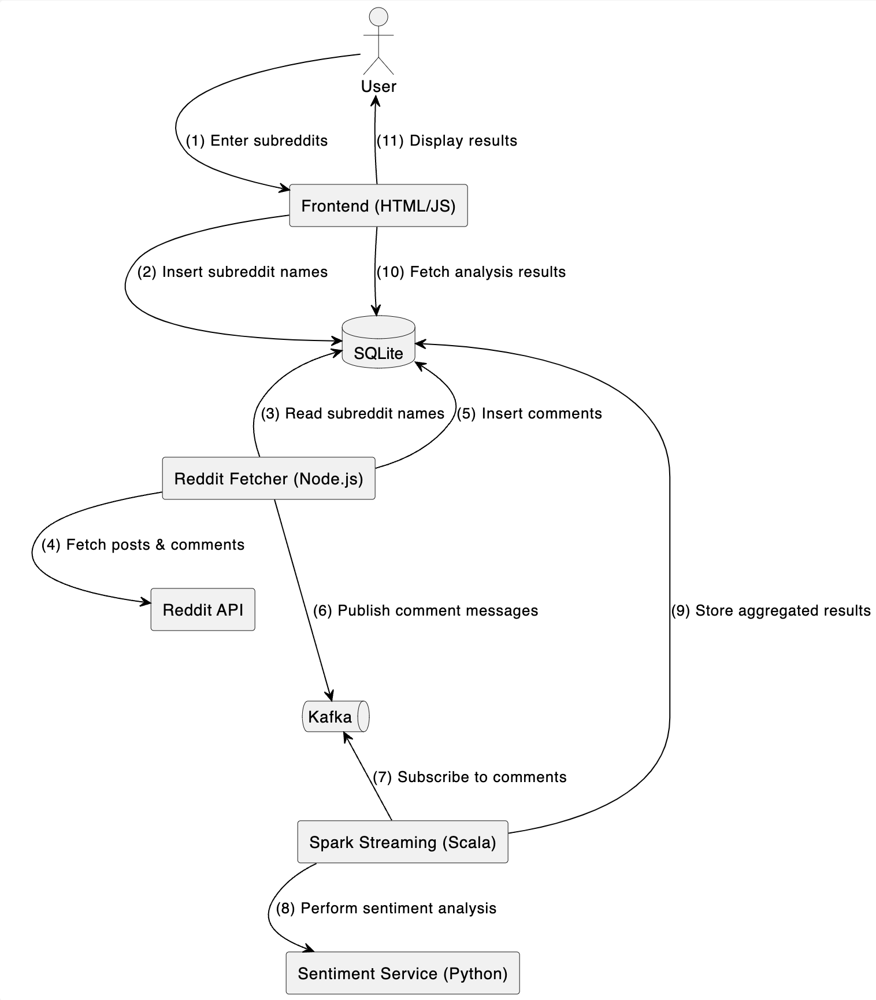

# Reddit Sentiment Analysis Tool

## Overview

This project is a sentiment analysis pipeline for Reddit data using Node.js, Kafka, Spark Streaming (Scala), and a Python Flask service that performs text sentiment classification. The pipeline fetches data from Reddit, stores it in a SQLite database, publishes and consumes the data through Kafka, processes it in Spark Streaming for word frequency and sentiment aggregation, and finally makes the aggregated results available through a REST API.

## Main Components

### 1. producer/

-   **redditFetcher.js**: Fetches hot posts and top comments from user-selected subreddits on Reddit, stores them in a local SQLite database, and sends the newly inserted comments to Kafka.
-   **kafkaProducer.js**: Initializes a Kafka producer and handles sending messages to the configured Kafka topic.
-   **db.js**: Initializes and manages the SQLite database connection.
-   **index.js**: Entry point that sets up the periodic fetching job (using setInterval) to pull new Reddit data at an interval defined by FETCH_INTERVAL_MS.

### 2. spark-streaming/

-   **SparkStreamingJob.scala**: A Spark Streaming application written in Scala. It reads data from the Kafka reddit_comments topic, aggregates word frequencies and sentiment for each post, then updates the SQLite database with the results.
-   **Sentiment Analysis**: Calls an external REST API (the Python Flask service) to get the sentiment label for each comment.

### 3. sentiment-service/

-   **sentiment_service.py**: A Flask application that loads a pretrained Transformer model (via the transformers library) for sentiment classification. It provides an endpoint /api/sentiment that accepts a piece of text and returns its sentiment label (positive, negative, or neutral, depending on the model).

### 4. rest-api/

-   **server.js**: Node.js/Express REST API that exposes endpoints for:
    -   managing subreddits
    -   retrieving analysis results (including word frequency and sentiment data)
-   **public/**: A simple frontend (index.html + app.js) to display currently monitored subreddits, add new subreddits, and view sentiment analysis results in a table format.

### 5. start_pipeline.sh

-   A script that optionally cleans the database and Kafka topic, then starts the Spark job followed by the producer. You can modify it or comment/uncomment lines as needed.

## Prerequisites

-   Node.js (e.g., v16 or above)
-   Kafka (locally running or hosted)
-   Spark (version matching the dependencies in spark-streaming/pom.xml or as specified in start_pipeline.sh)
-   Python (3.8 or higher recommended), plus the following libraries:
    -   torch
    -   transformers
    -   flask
    -   etc. (see sentiment_service.py for details)
-   SQLite (likely already included in many OS distributions)
-   Scala (if running locally with spark-submit)

## Setup and Running

### 1. Install Node.js dependencies (Producer and REST API):

```bash
# Producer
cd sentiment-analysis-tool/producer
npm install

# REST API
cd ../rest-api
npm install
```

### 2. Install Python dependencies:

```bash
cd ../sentiment-service
pip install -r requirements.txt  # or pip install flask torch transformers
```

### 3. Start the Python sentiment service:

```bash
python sentiment_service.py
```

This will start the Flask server on port 5001.

### 4. Start Kafka (if not already running):

Make sure your Kafka broker is running on localhost:9092, or adjust the configuration in the config files.

### 5. Start Spark and Producer:

```bash
./start_pipeline.sh
```

### 6. Start the REST API:

```bash
cd rest-api
node server.js
```

### 7. Open the Web interface in your browser:

Navigate to http://localhost:3003/

## System Components UML diagram


